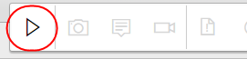
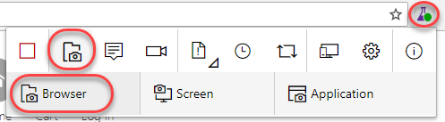
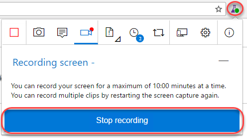
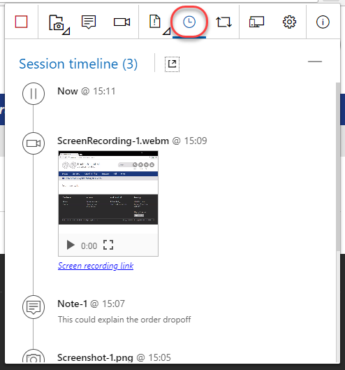
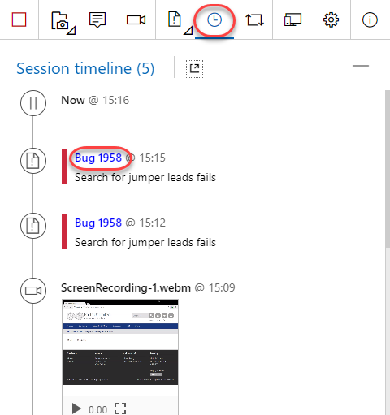
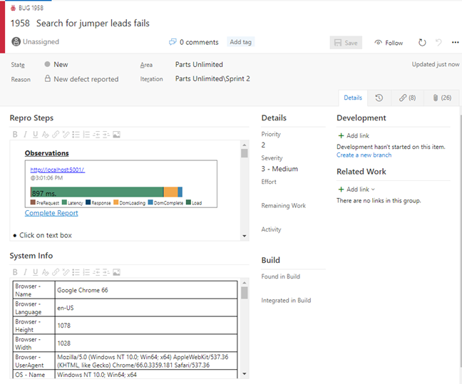

---
标题：使用Azure Test Plans测试计划进行探索性测试
布局：页面
侧边栏：vsts
固定链接：/ labs / azuredevops / exploratorytesting /
文件夹：/ labs / azuredevops / exploratorytesting /
版本：实验室版本-1.38.0
更新：最后更新-9/11/2019
redirect_from：“ / labs / vsts / exploratorytesting / index.htm”
---

# 使用Azure Test Plans测试计划进行探索性测试

 </ div>

## 概述 ＃＃

在本实验中，您将了解“测试与反馈”扩展中提供的探索性测试和反馈管理功能。您将了解探索性测试（也称为XT或敏捷测试）如何成为工具集中的一流体验。这使测试人员可以更灵活地测试基础软件，而不必完全依赖正式的测试用例。您还将了解如何管理引发和管理客户反馈生命周期的过程。

### 先决条件###

-本实验要求您按照<a href="../prereq/">先决条件</a>指令完成任务1和2。

## 练习1：探索性测试##

### 任务1：安装Chrome扩展程序###

1.从[http://google.com/chrome](http://google.com/chrome）安装** Google Chrome **。本练习的其余部分将使用Chrome作为其浏览器。如果您已经在使用Chrome，则只需为下一组步骤打开一个新实例即可。

1.导航至[http://marketplace.visualstudio.com]（http://marketplace.visualstudio.com/）上的“ Azure DevOps市场”。

1.选择“ Azure DevOps”选项卡。搜索“ ** feedback **”，然后单击“ Test＆Feedback **”扩展名。

 

1.在详细信息页面上单击“安装”按钮。

 

1.点击**安装**以安装Chrome扩展程序。

 

1.在“ Chrome网上应用店”中，单击“添加到Chrome”。

 

1.询问时确认安装。

 

1.要打开扩展名，请单击出现在地址栏右侧的扩展名图标。选择“连接设置”选项卡。输入您的Azure DevOps实例的URL，例如“ ** https：//dev.azure.com/MYTEAM**”作为“服务器URL”，然后单击“下一步”。

 

1.该扩展名可以在两种模式下使用：**已连接**和**独立**模式。如果您具有Azure DevOps或Azure DevOps服务器，请选择“连接模式”。独立模式适用于既没有用户又不想使用扩展程序来提交错误并与团队共享报告的用户。

1.连接到Azure DevOps之后，您将需要选择与这些工作相关联的团队。在“零件无限”项目下选择“零件无限团队”，然后单击“保存”以继续。

 

### 任务2：使用Chrome扩展程序进行探索性测试###

1.在** Visual Studio **中，按** F5 **本地构建并运行** Parts Unlimited **项目。

1.要启动探索性测试会话，请单击扩展工具栏上的“开始会话”按钮。

 

1.导航到[http：// localhost：5001]（http：// localhost：5001 /）。

1.在搜索框中输入**“跳线” **并按** Enter **。

 

1.您将看到如下所示的搜索结果。

 

1.现在，在搜索框中输入**“跳线” **并按** Enter **。

 

1.您可以看到没有搜索结果。当您搜索“跳线”时，它会显示结果。但是，当您搜索“跳线”时，它没有显示任何结果。这似乎是一个错误。

 

1.单击“探索性测试”图标按钮，然后选择“捕获屏幕快照”。浏览器**。

 

1.选择屏幕的一部分，然后将屏幕快照的名称更改为更具描述性的名称。请注意，有许多可用的绘图工具可以真正帮助您理解要点。点击“模糊区域”按钮。

 

1.突出显示屏幕截图的一部分，该部分将变得模糊不清，变得难以辨认。这使得报告错误和创建其他工作项变得容易，而不会冒敏感信息的风险。点击“保存屏幕截图”按钮，将其添加到当前会话的时间轴中。

 

1.单击**添加注释**按钮开始注释。输入具有洞察力的内容，然后单击“保存”以将注释保存到会话的时间轴中。

 

1.您还可以录制屏幕视频以捕获不稳定的问题，例如闪烁，Web应用程序的异常行为等，这些问题很难单独使用屏幕快照捕获。要录制屏幕，请点击“录制屏幕”按钮，然后点击“开始录制”。

 

1.从“应用程序窗口”选项卡中选择要记录的适当屏幕。在这种情况下，请选择404页面，然后点击“共享”。所选屏幕的录制已开始。

 

1.搜索**“跳线” **并显示结果。然后搜索“跳线” **，并显示结果不足。

 

1.单击扩展名上的**停止录制**按钮以停止录制屏幕。屏幕录像被保存。

 

1.单击“查看会话时间轴”按钮。您可以看到所有内容-您捕获的屏幕截图，注释和视频都可以在当前会话的时间轴中找到。您可以从此处打开屏幕截图，阅读笔记或播放视频。

 

### 任务3：使用Chrome扩展程序创建错误###

1.单击“创建错误”图标按钮，然后单击展开的“创建错误”文本按钮。

 

1.输入**“搜索跳线失败” **作为错误的名称。先前捕获的所有屏幕截图和视频已经是该错误的一部分。除此之外，还为您插入了图像操作日志（用户操作），以便其他人可以轻松地重现该问题。单击“保存”，将错误保存到Azure DevOps。

 

1.此扩展的另一个重要功能是它能够查看类似的错误，从而减少冗余问题。假设您是另一位测试人员，恰巧发现了这个错误，却不知道它已被记录。再次单击“创建错误”图标按钮，然后再单击扩展的“创建错误”文本按钮，以启动新的错误表单。

 

1.在为错误键入标题**“ jumper Leads **”时，您会注意到扩展名已检测到积压工作中已经存在另一个标题相似的错误。单击** 1类似**以查看类似的错误。

 

1.此错误似乎与我们将要提交的错误相同，因此，请选择它并单击“编辑”以编辑现有错误，而不是提交新的错误。

 

1.此时，当前的复制步骤已添加到图像操作日志中。实际上，您现在将查看现有的repro步骤，以确定是否使用其他方法找到了此错误，在这种情况下，您将更新内容以指示您的方法是替代的repro。单击“保存”以保存错误。

 

1.单击“查看会话时间轴”图标按钮，然后单击最后创建的“错误”链接以将其打开。

 

1.现在回到Azure DevOps站点，您可以根据需要更新错误，例如，将错误分配给某人或调整严重性。

 

1.在Chrome浏览器中，通过单击“停止会话”按钮结束测试会话。

 
