---
标题：使用Azure Test Plans进行测试计划和管理
布局：页面
侧边栏：vsts
固定链接：/ labs / azuredevops / testmanagement /
文件夹：/ labs / azuredevops / testmanagement /
版本：实验室版本-15.8.2
更新：最后更新-9/6/2018
redirect_from：“ / labs / vsts / testmanagement / index.htm”
---
# 使用Azure Test Plans进行测试计划和管理

 </ div>

 ## 概述  ##

在本实验中，您将学习如何使用Azure DevOps管理项目的测试生命周期。该项目将指导您创建旨在有效验证软件里程碑的测试计划。您还将创建并执行手动测试，这些手动测试可以在每个发行版的过程中一致地进行复制。

  ###  先决条件  ###  

-本实验要求您按照<a href="../prereq/">先决条件</a>指令完成任务1和2。

 ## 练习1：管理测试计划，套件和案例 ##

在本练习中，您将学习如何创建和管理测试计划，测试套件和测试用例。

  ###  任务1：了解测试计划，套件和案例  ###  

1.导航到Azure DevOps上的团队项目。

1.选择“测试计划”以导航到“测试中心”。测试中心为所有测试计划，执行和分析提供了一个中心位置。

 

1.一般来说，项目中的每个主要里程碑都应有自己的**测试计划**。每个测试计划中都有“测试套件”，它们是旨在验证工作项（例如功能实现或错误修复）的“测试用例”（以及可选的其他测试套件）的集合。每个测试用例都旨在确认一种特定的行为，并且可能属于一个或多个测试套件。零件无限制项目有一个测试计划，该计划位于“零件无限制团队” **下，称为“零件无限制_TestPlan1 **”。选择** Parts Unlimited_TestPlan1 **测试计划。

 

1.为该故事选择测试套件**作为客户，我想安全地存储我的信用卡详细信息**。这组测试重点在于该工作项，而该工作项恰好是一项功能。请注意，每次您为实验室生成演示数据时，工作项编号都会有所不同。

 

1.在右侧，您可以看到该测试套件具有三个测试用例，旨在确认功能实现的预期行为。双击“验证是否允许用户保存其信用卡详细信息”测试用例。

 

1.此对话框提供了有关此测试用例所需的所有信息。找到“相关工作”面板，并注意此测试用例已链接到它所属的套件。单击工作项以导航到它。

 

1.在测试套件中，我们可以看到所有链接的工作项，它们恰好是测试用例。

 

1.但是，它尚未与旨在测试的功能相关联，我们现在可以将其链接。点击**添加链接现有项目**。

 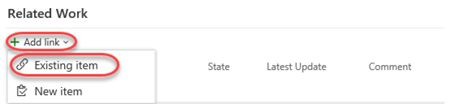

1.将“链接类型”设置为“父母”，然后搜索“信用卡” **。

 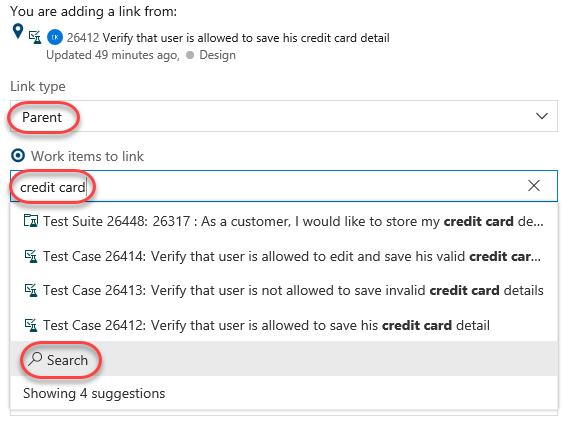

1.选择“信用卡购买”的“功能” **。

 

1.单击“确定”。

 

1.父功能现在与对其进行测试的套件相关联，并且任何人都可以在它们之间导航以查看其与所涉及的其他工作项的关系。

 

1.单击**保存并关闭**。

 

1.关闭原始的测试用例对话框。

  ###  任务2：管理测试  ###  

1.有时应按特定的顺序运行一组测试用例，以使效率最大化。单击“订购测试”以指定应运行这些测试用例的顺序。

 

1.虽然可以单独运行这些测试用例以确认行为，但最好先运行拒绝无效卡的测试用例。然后，测试人员可以确认可以保存有效卡，然后是测试用例以编辑已保存的卡。将第二个测试用例拖放到第一个测试用例上方，然后单击“完成”。

 

1.现在，您可以看到** Order **已更新，并且列表已按其排序。

 

1.测试的另一个重要方面与运行每个测试的环境有关。对于此Web应用程序，浏览器和操作系统是关键考虑因素。目前，所有测试仅使用一种配置：Windows 10。

 

1.选择“配置”选项卡。

 

1.请注意，** Windows 10 **现有一种配置。每个测试配置都包括名称和描述，以及一组可自定义的**配置变量**。该项目为“操作系统”设置了一个配置变量。您可以轻松添加更多和/或编辑每个条目的可用条目。点击**添加配置变量**。

 

1.选择** Browser **变量并将其设置为** Microsoft Edge **。

 

1.单击**保存**以保存配置。

 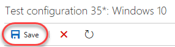

1.现在，假设测试团队已经购买了iPhone X，并希望将其添加到测试矩阵中。将环境注册为新配置非常容易，以便测试用例可以指定它。不过，在添加之前，我们需要针对** iOS 10 **的** Operating System **（操作系统）选项。单击“操作系统”配置变量。

 

1.单击**添加新值**并为** iOS 12 **添加一个条目。

 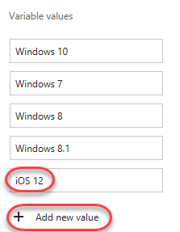

1.单击**保存**。

 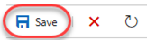

1.现在，我们拥有添加iPhone X所需的一切。单击**添加**下拉列表，然后选择**新测试配置**。

 

1.将“名称”设置为“ iPhone X” **。

 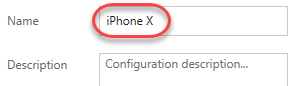

1.单击两次“添加配置变量”，然后将“浏览器”设置为Safari，将操作系统设置为iOS 12。

 

1.单击**保存**以保存新配置。

 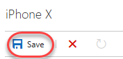

1.返回“测试计划”选项卡。

 

1.单击到目前为止我们一直在使用的测试套件旁边的下拉列表，然后选择“将配置分配给测试套件”。

 

1.选中“ iPhone X”选项，然后单击“保存”。

 

1.请注意，每个测试用例均已使用** iPhone X **的附加配置进行了复制。现在可以分别测试和跟踪每个环境。

 

  ###  任务3：编写测试  ###  

1.展开测试计划旁边的下拉菜单，然后选择**新静态套件。**测试用例的“静态套件”是已手动分配用例的套件。您还可以基于通用需求（**基于需求的套件**）或测试用例和/或工作项的查询（**基于查询的套件**）来创建套件。

 

1.将新套件的名称设置为**“运输测试” **。这些测试将全部集中在与运输相关的功能上。请记住，您可以轻松地在套件之间共享测试用例，因此，在有许多重叠套件时，冗余度很小。

 

1.展开新创建的套件旁边的下拉菜单，然后选择**新的基于需求的套件**。

 

1.您可以自定义用于指定要检索哪些需求的查询，但只需保留默认值，然后单击“运行查询”即可。找到并选择与运输相关的三个产品待办事项。单击“创建套件”以为每个套件创建一个测试套件。

 

1.选择一个新创建的套件，例如与跟踪程序包状态关联的套件。

 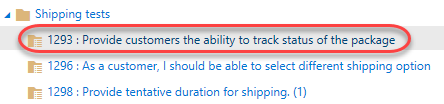

1.虽然可以一次创建一个测试用例，但有时使用网格布局来快速添加许多测试用例会更容易。在测试用例面板中，选择** New \ |使用网格的新测试用例**。

 

1.输入一些测试用例，然后单击“全部保存”按钮。标题将是测试用例的最终标题。 **步骤操作**将是测试的第一步（可能也是唯一一步）。如果该步骤具有预期结果，则可以将其指定为“步骤预期结果”。

 

1.您可以选择继续在网格视图中添加和编辑工作项。如果满意，请单击“视图：网格”切换返回列表视图。

 

1.列表视图显示相同的数据，但视图不同。

 

1.创建套件的另一种方法是通过工作项查询。展开“运输测试”套件旁边的下拉菜单，然后选择“基于查询的新套件”。

 

1.假设您想从与项目中交付相关的测试用例中创建一个测试套件。将“工作项类型”更改为“ Microsoft.TestCaseCategory”以搜索测试用例，然后单击“运行查询”。现在，您将获得一个测试用例列表，可以选择从中创建套件。

 

1.按** Esc **关闭对话框。

 ## 练习2：创作，运行和分析手动测试 ##

在本练习中，您将学习如何创建手动测试计划并按步骤进行填充。以后可以运行该计划，以确认软件的预期行为。在本实验中，我们将专注于创建新的手动测试用例并运行它。

  ###  任务1：安装测试和反馈扩展  ###  

1.从[http://google.com/chrome](http://google.com/chrome）安装** Google Chrome **。本练习的其余部分将使用Chrome作为其浏览器。如果您已经在使用Chrome，则只需为下一组步骤打开一个新实例即可。

1.导航至[http://marketplace.visualstudio.com]（http://marketplace.visualstudio.com/）上的“ Azure DevOps市场”。

1.选择“ Azure DevOps”选项卡。搜索“ ** feedback **”，然后单击“ Test＆Feedback **”扩展名。

 

1.在详细信息页面上单击“安装”按钮。

 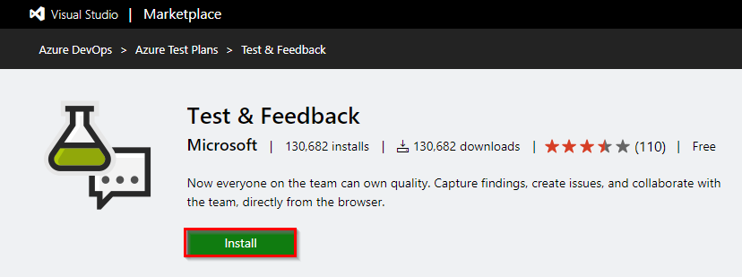

1.点击**安装**以安装Chrome扩展程序。

 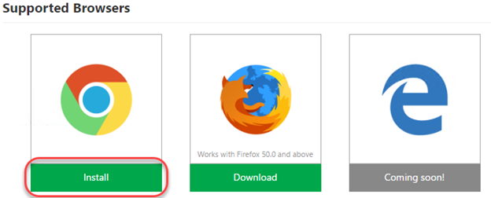

1.在“ Chrome网上应用店”中，单击“添加到Chrome”。

 

1.询问时确认安装。

 

1.要打开扩展名，请单击出现在地址栏右侧的扩展名图标。选择“连接设置”选项卡。输入Azure DevOps实例的URL，例如“ ** https：//MYTEAM.visualstudio.com**”作为“服务器URL”，然后单击“下一步”。

 

1.该扩展名可以在两种模式下使用：**已连接**和**独立**模式。如果您有Azure DevOps或Team Foundation Server（TFS），请选择“连接模式”。独立模式适用于没有Azure DevOps或TFS并希望使用扩展程序来提交错误并与团队共享报告的用户。

1.连接到Azure DevOps之后，您将需要选择与这些工作相关联的团队。在“零件无限”项目下选择“零件无限团队”，然后单击“保存”以继续。

 

  ###  任务2：编写手动测试计划  ###  

1.在Chrome浏览器中，导航到“零件无限”项目。

1.和以前一样，导航至“测试计划”中枢。

 

1.展开测试计划旁边的下拉列表，然后选择** New static suite **。

 

1.将新套件命名为““端到端测试””，然后按** Enter **。

 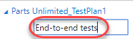

1.从“测试”选项卡中，选择“新建\ |”。新的测试用例**，以创建新的测试用例。

 

1.在“标题”框中，键入“ ** 确认订单成功后显示订单号 **”作为新测试用例的名称。

 

1.至此，我们准备为该手动测试添加步骤。每个步骤都包含一个“操作”，它描述了测试人员需要执行的操作。可选地，一个步骤可以包括“预期结果”，它描述了给定操作的预期结果。在“步骤”面板中，为以下每个“操作”创建一个步骤，其中只有一个具有“预期结果”。

    |Action|Expected Result|
    --- | ---
    |Open project site||
    |Click Brakes||
    |Click Disk and Pad Combo||
    |Click Add to Cart||
    |Click Checkout||
    |Enter @Email, @Password||
    |Enter @Name, @Phone, @Email, @Address, @City, @State, @PostalCode, @Country, @Promo||
    |Click Submit Order||
    |Confirm order page has order #|Order # should appear on order confirmation page|
    |Log out||
    |Close browser||

   **注意：**如果最后空了一步，请将其删除。

1.此时，“步骤”面板应类似于以下内容：

 

1.注意“输入@ Email，@ Password”和“输入@ Name，@ Phone，@ Email，@ Address，@ City，@ State，@ PostalCode，@ Country，@ Promo”步骤。在这些步骤中，我们使用** @ **符号表示在手动测试过程中将使用特定于迭代的变量。我们可以通过向下滚动到此表单的“参数值”部分并为每次迭代输入它们来定义要使用的变量。请注意，您可能需要使用测试用例对话框最右侧的滚动条来查看此部分。

 

1.使用下表设置两次迭代的值。

   |Fields|Iteration 1|Iteration 2|
   --- | --- | ---
   |Email|admin@test.com|sachin@test.com|
   |Password|P@ssw0rd|P@ssw0rd|
   |Name|Admin User|Sachin Raj|
   |Phone|425-555-1234|555-555-5555|
   |Address|One Microsoft Way|Two Tailspin Trail|
   |City|Redmond|Springfield|
   |State|WA|IL|
   |PostalCode|98052|11135|
   |Country|USA|USA|
   |Promo|FREE|FREE|

1.现在，“参数值”部分应如下所示。请注意，您可以根据需要输入尽可能多的迭代来完全测试场景的广度。

 

1.单击**保存并关闭**以保存测试用例。

 

  ###  任务3：运行手动测试计划  ###  

1.在此任务中，您将学习如何运行我们之前创建的手动测试计划。请注意，触发自动测试运行的过程遵循类似的工作流程。您可以在[文档]（https://docs.microsoft.com/zh-cn/vsts/build-release/test/run-automated-tests-from-test-hub）中了解有关此内容的更多信息。

1.右键单击先前创建的测试用例，然后选择“使用选项运行**”以开始手动测试运行。

 

1.您可以使用一些选项来自定义每个测试运行。第一个选项是选择** Runner **，它将是这种情况下的浏览器。接下来，您可以选择指定要收集哪种**数据。最后，您可以选择指定要测试的构建，以便更轻松地将结果与它们来自的构建相关联。单击“确定”继续。

 

1.如果没有出现“测试运行器”窗口，请检查它是否被弹出窗口阻止程序阻止。如果是这样，请单击“弹出窗口阻止程序”按钮，选择“始终允许弹出窗口...”，然后单击“完成”。然后，您可以成功再次启动测试运行。

1.在“测试运行器”窗口中，展开“测试1之1：迭代1”下拉菜单。请注意，这里有两次迭代：对于测试用例中指定的每组参数，一次迭代。在第一次迭代中，使用[admin@test.com]（mailto：admin@test.com）帐户。在第二个中，将使用[sachin@test.com]（mailto：sachin@test.com）。

 

1.测试的第一步是打开项目站点。为此，请切换到已加载** Parts Unlimited **解决方案的** Visual Studio **实例。从“ IIS Express”目标下拉列表中，选择“浏览...”。

 

1.选择** Google Chrome **，然后单击**浏览**。

 

1.如果您在大屏幕上工作，则调整新窗口的大小以适合“测试运行器”窗口旁边可能会更容易。否则，您可以来回切换。

 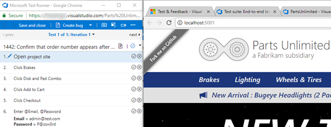

1.网站载入后，返回“测试运行器”并单击“通过测试步骤”按钮。完成此测试的后续步骤时，请确保也检查它们的“通过测试步骤”按钮。

 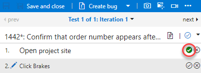

1.下一步是单击“ Brakes”菜单。

 

1.然后单击“磁盘和Pad Combo”产品。

 

1.下一步是单击“添加到购物车”。

 

1.在下一页上，单击“结帐”。

 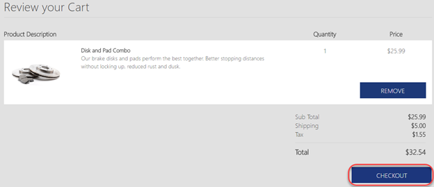

1.使用下一步中指定的凭据登录。

 

1.不幸的是，这将失败，因为没有[admin@test.com]（mailto：admin@test.com）帐户。

 

1. ** Test Runner **提供了三种有价值的方式来记录测试运行中的媒体。第一种选择是截取屏幕截图。第二个是在图像操作日志中捕获每个用户操作。最后是将屏幕录制为视频。单击“捕获屏幕快照”按钮以捕获屏幕快照。

 

1.缩小屏幕以显示登录表单和错误消息。指定名称**“无管理员帐户” **，然后单击“确认”按钮。

 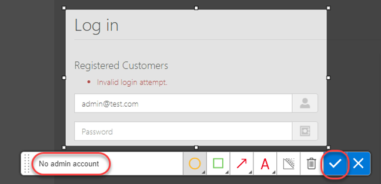

1.右键单击失败的步骤，然后选择“添加注释”。

 

1.输入注释“默认情况下不存在管理员帐户” **，然后使用“失败测试步骤”按钮使测试失败。

 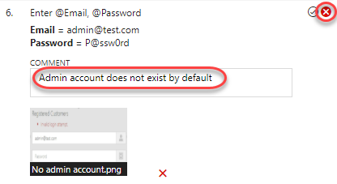

1.单击“创建错误”以记录新的错误。

 

1.输入错误标题“ **默认情况下不存在管理员帐户” **，然后单击“保存并关闭”以记录该错误。

 

1.由于由于与测试功能不直接相关的错误而无法完成测试，因此请展开“标记测试用例结果”下拉菜单并选择“阻止测试”。单击“保存并关闭”以保存测试运行。

 

1.关闭测试浏览器窗口。

  ###  任务4：分析手动测试结果  ###  

1.在此任务中，您将学习如何查看手动测试运行的结果。

1.返回托管“测试中心”的浏览器窗口。选择“运行”标签。

 

1.双击最新的测试运行以将其打开。您可能需要刷新数据才能看到它。

 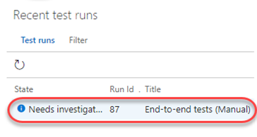

1.“运行摘要”选项卡提供测试运行的概述，以及运行中包含的所有测试结果的高级详细信息。

 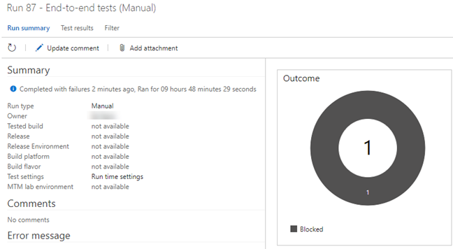

1.选择“测试结果”选项卡。此选项卡列出了运行中包含的每个测试案例的结果及其结果。由于此处仅包含一个测试用例，因此双击它以将其打开。

 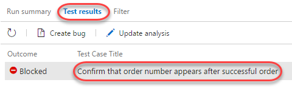

1.您可以从此处查看此特定测试用例的所有详细信息。

 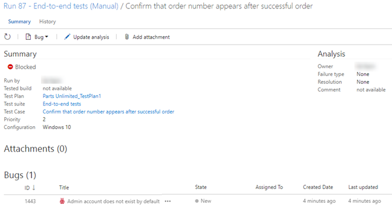

1.滚动到底部以找到迭代。展开第一次迭代。

 

1.查看此迭代中每个步骤的结果以及失败的登录步骤，该步骤显示了测试运行过程中随附的屏幕截图。

 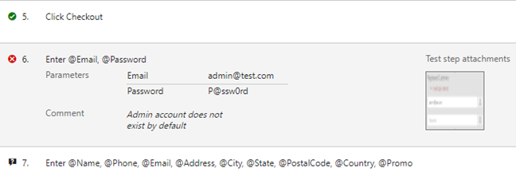

  ###  任务5：创建共享步骤  ###  

1.在此任务中，您将学习如何创建共享步骤。共享步骤将通常按顺序执行的多个步骤组合为一个逻辑步骤，可以在测试之间共享。如果将来由共享步骤定义的过程发生变化，则可以在一处更新共享步骤，它将在引用该共享步骤的所有测试中得到反映。

1.单击“摘要”部分中的测试用例链接。

 

1.双击案例以在测试案例编辑器中将其打开。

 

1.选择步骤2-4（使用Shift + Click **），然后单击“创建共享步骤”按钮。

 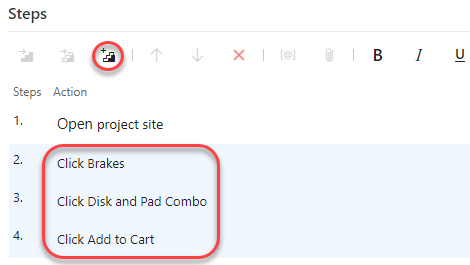

1.将这些共享步骤的名称设置为**“将磁盘和Pad Combo添加到购物车” **，然后单击**创建**。

 

1.现在，您可以看到以前的步骤已被共享步骤替换。双击共享步骤以打开。

 

1.如有必要，您可以稍后重新访问这些步骤，以针对新要求更新它们。

 

1.按** Esc **键关闭** Shared Steps **对话框。

1.单击**保存并关闭**以保存测试用例。

 
