<div class="rw-ui-container"></div>
<a name="Overview"></a>


## 概述 ##

许多团队更喜欢使用YAML（又一种标记语言）定义其构建和发布管道。这样一来，他们可以访问与使用视觉设计器相同的管道功能，但可以使用可以像其他任何源文件一样进行管理的标记文件。只需将YAML构建定义的源文件添加到存储库的根即可将其添加到项目中。 Azure DevOps还提供了流行项目类型的默认模板，以及一个YAML设计器，以简化定义生成和发布任务的过程。

<a name="先决条件"></a>
### 先决条件 ###

-本实验要求您从[先决条件说明](../prereq)中完成任务1。

下图将引导您完成本实验中介绍的所有步骤

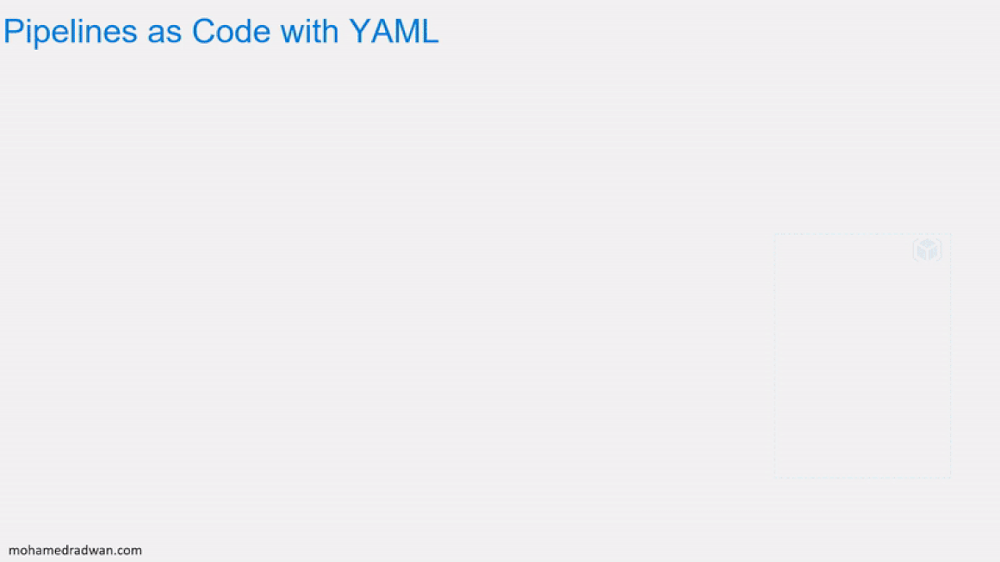
 
<a name="Exercise1"> </a>
## 练习1：在Azure DevOps中使用YAML将CI / CD管道配置为代码 ##

<a name="Ex1Task1"> </a>
### 任务1：创建Azure资源 ###

1. 此实验室需要将Parts Unlimited项目部署到Azure应用服务中。为此，您将需要旋转必要的基础结构。通过[https://portal.azure.com]（https://portal.azure.com/）登录到您的Azure帐户。

2. 单击 **Create a resource**，然后搜索**Web App + SQL**。


3. 选择Microsoft发布的**Web App + SQL**选项。

 

4. 单击**Create**。

   

5. 输入应用程序服务的全局唯一名称。您可能会发现，最容易加上您的名字，例如**pul-yaml-johndoe**。选择选Resource Group选项选择**create a new** ，命名：**partsunlimited**

 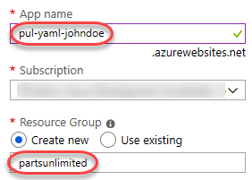

6. 选择选项以配置**SQL Database**。单击**Create a new database**，然后输入名称 **partsunlimited-yaml**。

 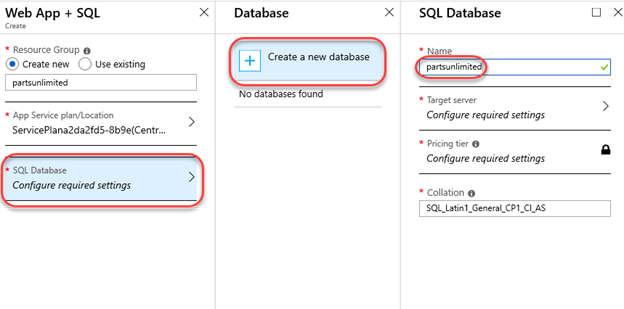

7. 选择选项以配置**Target server**，然后单击**Create a new server**。输入全局唯一的服务器名称，例如 **pul-yaml-johndoe** 并提供管理员凭据。确保选中**Allow Azure services to access server**复选框。单击**Select**以确认服务器设置。

 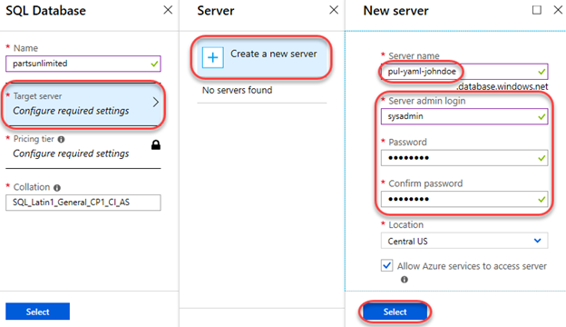

8. 在**Pricing Tier**上，选择**Standard**并保留默认选项。点击**Apply**。

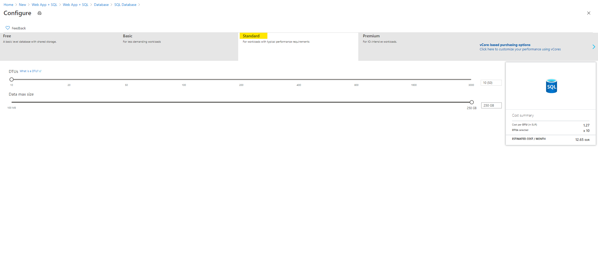

9. 单击**Select**以确认数据库设置。

 

10. 单击**创建**以创建资源。请注意，如果您还没有计划，则可能需要先创建一个应用程序服务计划。

 

11. 资源配置将需要几分钟，因此您可以继续执行下一个任务。

<a name="Ex1Task2"> </a>
### 任务2：配置零件无限项目 ###

12. 在新的浏览器选项卡中导航到Azure DevOps上的团队项目。在深入研究YAML管道之前，您将需要禁用现有的构建管道。

13. 导航到**Pipelines**。

 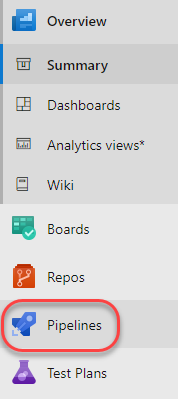

14. 选择现有的**PartsUnlimitedE2E** pipeline流水线。

 

15. 从下拉列表中，选择**Pause pipeline**。

 

<a name="Ex1Task3"> </a>
### 任务3：添加YAML构建定义 ###

1. 导航到**Pipelines**中心。

 

2. 单击**New pipeline**。我们将使用向导根据项目自动创建YAML定义。

 

3. 选择**Azure Repos Git**作为源托管平台。请注意其他受支持的。

 

4. 选择**PartsUnlimited** Repo（代码仓库）。

 

5. 选择**ASP.NET**模板作为管道的起点。

 

6. 查看YAML定义的内容。它将作为一个名为 **azure-pipelines.yml**的新文件保存在资源库的根目录中，其中包含构建和测试典型ASP.NET解决方案所需的所有内容。您还可以根据需要自定义构建。在这种情况下，更新 **pool**以指定生成应使用Visual Studio 2017生成VM。

 

7. 查看trigger触发器，如果​​您的Repo没有**main**，则指向**master**（新的repo将具有"main"替代“master”）。

8. 单击**Save and run**。

 

9. 单击Click **Save and run**.以确认提交。

 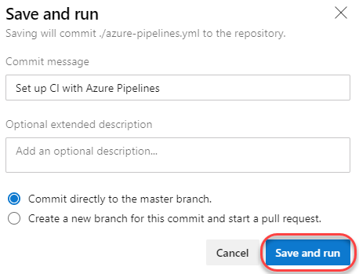

10. 跟踪构建，直到完成。单击 **Job** 以查看日志。

 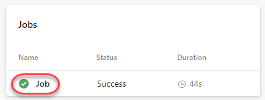

11. YAML文件中的每个任务都可供查看，包括任何警告和错误。

 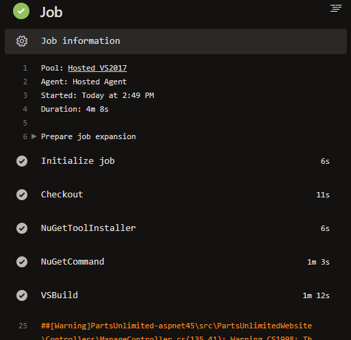

12. 关闭任务视图。

 

13. 选择**Tests**选项卡。

 

14. 测试现在应该可以按预期成功。

 

<a name="Ex1Task4"> </a>
### 任务4：向YAML定义中添加连续交付 ###

1. 现在，构建和测试过程已成功完成，我们现在可以将交付内容添加到YAML定义中。从选项下拉列表中，选择**Edit pipeline**。

 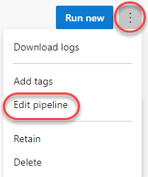

2. 在**trigger**部分之后添加以下配置行，以在YAML管道中定义**Build**阶段。您可以定义所需的任何阶段，以更好地组织和跟踪管道进度。

    ```yaml
    stages:
    - stage: Build
      jobs:
      - job: Build
    ```
 

3. 突出显示（选择）YAML文件的其余部分，并将其缩进四个空格（两个选项卡）。 “ pool”（包括在内）之后的所有内容都应属于“ job：Build”。这将简单地采用现有的构建定义并将其重新定位为**jobs** 节点的子代。

 

4. 在文件底部，添加以下配置以定义第二阶段。

    ```
    - stage: Deploy
      jobs:
      - job: Deploy
        pool:
          vmImage: 'vs2017-win2016'
        steps:
    ```
 

5. 将光标放在YAML定义末尾的新行上。这将是添加新任务的位置。

 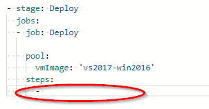

6. 选择**Azure App Service Deploy**任务。

 

7. 选择您先前在其中创建应用程序服务的Azure订阅。点击 **Authorize** ，然后按照路径完成授权。

 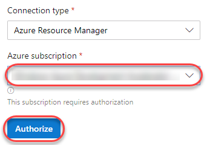

8. 输入您之前用于创建应用程序服务的 **App Service name** 。将     **Package or folder**更新为 **$(System.ArtifactsDirectory)/drop/*.zip**。不是 **$(System.DefaultWorkingDirectory)!**。点击**Add**。

 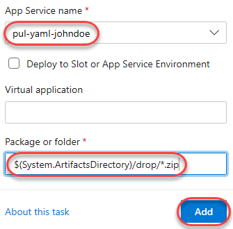

9. 定义任务的YAML将添加到文件中的光标位置。

 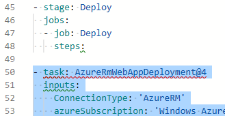

10. 在添加的任务仍在编辑器中选中的情况下，将其缩进四个空格（两个选项卡），以使其成为**steps** 任务的子级。

 

   >注意：**packageForLinux**参数在示例中有点误导，但对Windows或Linux有效。这是**Package**的别名，因此可以简化为

11. 重要的是要注意，这两个阶段将独立运行。因此，如果没有特殊考虑，第一阶段的构建输出将无法用于第二阶段。为此，我们将使用一个任务在构建阶段结束时发布构建输出，并使用另一个任务在部署阶段开始时将其下载。将光标放在构建阶段结束时的空白行上。

 

12. 在任务中搜索 **publish build**，然后选择**Publish Build Artifacts**任务。可能有不止一种可用，因此请确保选择未弃用的一种。

 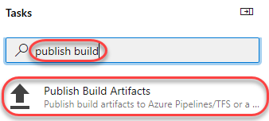

13. 接受默认值，然后单击**Add**。这会将构建工件发布到可以以别名 **drop**下载的位置。

 

14. 将发布任务缩进四个空格（两个选项卡）。您可能还需要在前后添加一个空行，以使其更易于阅读。

 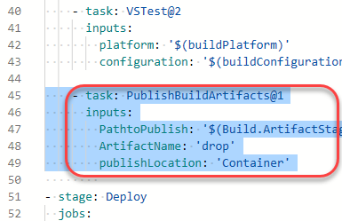

15. 将光标放在部署阶段的 **steps**节点下的第一行上。

 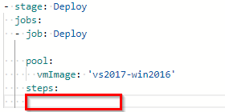

16. 在任务中搜索 **download build**，然后选择**Download Build Artifacts**任务。

 

17. 单击 **Add** 。

 

18. 将发布任务缩进四个空格（两个选项卡）。您可能还需要在前后添加一个空行，以使其更易于阅读。

 

19. 在下载任务中添加一个属性，指定**artifactName**的值为：**drop** ,确保间距匹配。
    
    ```
    artifactName: 'drop'
    ```
  

20. 单击 **Save** 以提交更改。


21. 确认 **Save** 。这将开始一个新的版本。

 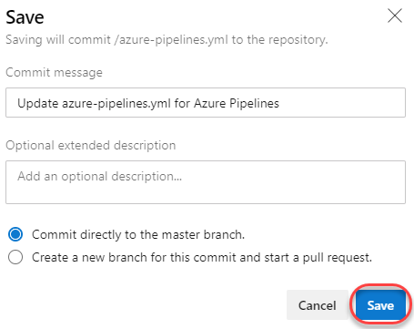

22. 返回到 **Pipelines** 视图。

 

23. 从 **Runs** 选项卡中，单击新的构建运行以将其打开。请注意，现在根据先前的YAML定义编辑显示了多个阶段。

 

24. 如果看到错误消息，需要您的许可，请单击 **view**按钮。然后单击两次**Permit**。

 

 

25. 单击 **Deploy** 阶段以遵循每个任务。

 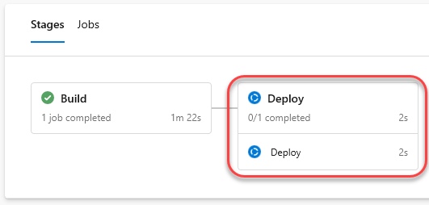

26. 展开 **AzureRmWebAppDeployment** 任务以查看Azure部署期间执行的步骤。任务完成后，您的应用将在Azure上运行。

 

<a name="Ex1Task5"> </a>
### 任务5：查看已部署的站点###

1. 返回到Azure门户浏览器选项卡。

2. 导航到之前创建的应用程序服务。

3. 选择 **Configuration** 选项卡。

 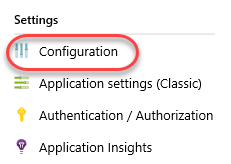

4. 单击 **defaultConnection** 设置。

 

5. 将 **Name** 更新为 **DefaultConnectionString**，这是应用程序期望的密钥。这将使它能够连接到为应用程序服务创建的数据库。点击**OK**。

 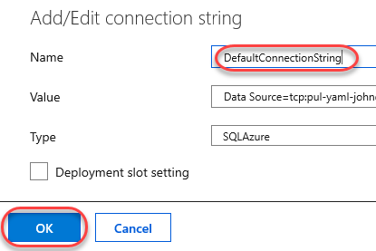

6. 单击 **Save** 以应用更改。

 

7. 返回 **Overview** 选项卡。

 

8. 单击 **Browse** 以在新选项卡中打开您的网站。

 

9. 部署的站点应加载预期的负载。

 


## 参考

您可以观看以下视频，引导您完成本实验中介绍的所有步骤

<figure class="video_container">
  <iframe width="560" height="315" src="https://www.youtube.com/embed/i77vEEVAfB8" frameborder="0" allowfullscreen="true"> </iframe>
</figure>